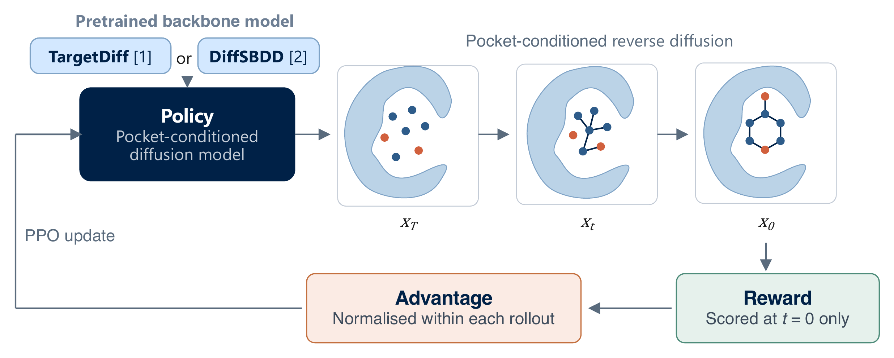

# PRISM: Policy-Reinforced Iterative Structure-Based Molecular Diffusion

Official implementation of PRISM: A Hybrid Diffusion-Reinforcement Learning Framework for 3D Structure-based De Novo Design. 

PRISM framework takes a pretrained **DiffSBDD** or **TargetDiff** checkpoint and tunes layers so generated
ligands optimise a chemistry reward while staying close to the pretrained prior.

## Workshop Paper

**PRISM: A Hybrid Diffusion-Reinforcement Learning Framework for 3D Structure-based De Novo Design**

Sanaz Kazeminia, Lewis R. Vidler, Pushkar G. Ghanekar, Nele P Quast, Garrett M Morris

[](https://openreview.net/forum?id=TAeVNZ77sH)
[](LICENSE)



[Environment](#environment) · [Checkpoints and data](#checkpoints-and-data) · [Train](#train) · [Inference](#inference) · [Case study](#case-study-estrogen-receptor-alpha) · [Data preparation](#data-preparation) · [Layout](#layout) · [Citation](#citation)

## Environment

```bash
conda env create -f environment.yml
conda activate PRISM_25
pip install -e .
```

`environment.yml` pins torch 2.6.0+cu124 and the matching PyG wheels. For a
different CUDA version, change `cu124` in the two index URLs and in the three
`+cu124`/`+pt26cu124` pins at the top of the `pip:` section. torch 2.6.0 has PyG
wheels for `cpu`, `cu118`, `cu124` and `cu126` — there is no `cu121` build.

Check it worked:

```bash
python -c "import torch, torch_scatter, torch_geometric, prism; print(torch.cuda.is_available())"
python -m pytest tests/unit -q
```

## Checkpoints and data

Fine-tuned checkpoints from the paper, and the estrogen receptor alpha
case-study inputs: **https://zenodo.org/records/22229237**

Each `.pt` is the native backbone format the generation scripts load.

| File | Backbone | Reward | Seed | Epoch |
|---|---|---|---|---|
| `prism_diffsbdd_penalised_logp_seed42_ep25.pt` | DiffSBDD | penalised LogP | 42 | 25 |
| `prism_targetdiff_penalised_logp_seed976_ep13.pt` | TargetDiff | penalised LogP | 976 | 13 |
| `prism_diffsbdd_geometry_seed42_ep09.pt` | DiffSBDD | geometry | 42 | 9 |
| `prism_diffsbdd_multiobj_seed976_ep27.pt` | DiffSBDD | geometry + docking + QED + SA (weighted sum) | 976 | 27 |
| `prism_targetdiff_multiobj_seed789_ep17.pt` | TargetDiff | geometry + docking + QED + SA (product) | 789 | 17 |
| `prism_targetdiff_case_estrogen_receptor_alpha_seed976_ep54.pt` | TargetDiff | ERα: feature density + property_2d + geometry (product) | 976 | 54 |

`era_case_study_data.zip` holds the ERα inputs: the PDB list, the hotspot
`.pkl`, `propeties_ref.json`, and the three held-out pockets. The rest of the
pipeline regenerates from the PDB list.

PPO training is not bitwise reproducible across GPUs. Use these checkpoints to
reproduce the paper numbers.

## Train

PPO fine-tunes a pretrained checkpoint, so download one first and put it under
`checkpoints/`:

- DiffSBDD — https://github.com/arneschneuing/DiffSBDD
- TargetDiff — https://github.com/guanjq/targetdiff

```bash
python scripts/train.py \
    --config configs/targetdiff/targetdiff_default.yaml \
    --warm_start_from_ddpm checkpoints/targetdiff_pretrained_diffusion.pt
```

For DiffSBDD, swap in `configs/diffsbdd/diffsbdd_default.yaml` and a DiffSBDD
checkpoint; the config's `model_type` selects the backbone.

Both default configs reward QED and synthetic accessibility only
(`weighted_sum`, 0.5 each). Other PPO settings match the multi-objective runs.


Checkpoints land in
`Log_Results/<logdir>/<run_identifier>/checkpoints/<dataset>/seed=<S>/`, saved as
both `.ckpt` (Lightning) and `.pt`. Top-3 by `train/reward_mean`, plus `last`.

### Config

One YAML per experiment, under `configs/<backbone>/`. Clone
`targetdiff_default.yaml` or `diffsbdd_default.yaml` and change what you need.

| Section | What it controls |
|---------|------------------|
| top level | `run_identifier` (names the output dir), `datadir`, `gpus`, `freeze_except` (which blocks to unfreeze — everything else stays frozen to anchor the prior) |
| `model:` | checkpoint path, dims, `total_timesteps` (must match the pretrained checkpoint) |
| `ppo:` | `num_outer_epochs`, `num_inner_epochs`, `n_steps` (mols per rollout), `lr`, `clip_range`, `target_kl`, `ref_kl_coef`, `train_timesteps`, `timestep_window` |
| `reward_params:` | `aggregation` (`weighted_sum` or `product`), per-reward weights under `rewards:`, plus `reward_paths:` and `target_name` |

Rewards with weight `0.0` are inactive — only weights > 0 get instantiated. Under
`product` aggregation the weights act as exponents, not a partition of 1.

Commonly used reward keys (full list in `src/prism/reward/factory.py`):

| Key | What it scores |
|-----|----------------|
| `geometry_checks` | 3-D geometry validity (PoseBusters bounds) |
| `smina_docking` | Docking score via Smina |
| `feature_density` | Pharmacophore hotspot overlap — needs a hotspot `.pkl` |
| `property_2d` | 2-D property match to a reference binder set |
| `custom_qed`, `custom_sa_score` | Capped/normalised drug-likeness and synthesisability |
| `penalised_logp` | Penalised LogP |

To add one: implement `BaseReward` in `src/prism/reward/scoring/`, register it in
`factory.py`, give it a weight key.

## Inference

The `test_*` scripts take a `.pt`/`.ckpt` checkpoint, the run's config, and
`--model diffsbdd|targetdiff`. The `generate_*` scripts are per-backbone and
take no `--model`.

**CrossDocked test set** — a directory of pocket/ligand pairs:

```bash
python -m scripts.test_crossdocked \
    <checkpoint> \
    --model targetdiff \
    --config configs/targetdiff/targetdiff_default.yaml \
    --test_dir data/cross_dock/.../test \
    --outdir results/targetdiff/<run> \
    --n_samples 100 --batch_size 84
```

Pairs each `<stem>.sdf` reference ligand with `<stem>_pocket.pdb`, falling back
to `<pdb_id>.pdb` for raw PDBs. DiffSBDD also takes an optional `<stem>.txt`
residue list.

**A single pocket** — `scripts.generate_diffsbdd` / `scripts.generate_targetdiff`:

```bash
python -m scripts.generate_targetdiff \
    <checkpoint> \
    --config configs/targetdiff/targetdiff_default.yaml \
    --pdbfile path/to/pocket.pdb \
    --ref_ligand path/to/ref_ligand.sdf \
    --outfile results/generated.sdf \
    --n_samples 100
```

`--ref_ligand` cuts the pocket to 10 Å around the reference ligand, matching
TargetDiff training. Omit it only if the PDB is already a cut pocket — on a full
protein it drops validity sharply.

Evaluate the resulting SDFs with `val_analysis/metrics.py` (QED, SA, diversity,
PoseBusters) and `val_analysis/smina_docking.py`.

## Case study: estrogen receptor alpha

Fine-tunes on one target instead of the whole CrossDocked set. Reward is a
pharmacophore hotspot match, a 2D property match to known binders, and
geometry, combined as a product.

**1. Get the inputs.** Download `era_case_study_data.zip` from the Zenodo
record above.

**2. Build the dataset.** Fetches the structures, cuts the pockets, writes the
`.npz` files, and drops the three held-out structures:

```bash
python -m scripts.process_data \
    --pdb_list estrogen_recep_alpha_pdb_list.txt \
    --output_dir data/Estrogen_recep_alpha \
    --model targetdiff
```

Put the hotspot `.pkl` in `data/Estrogen_recep_alpha/hotspot_analysis/` and
`propeties_ref.json` in `src/prism/reward/scoring/reward_data/`.

**3. Train.** `--target_name` selects the hotspot and reference-binder stats:

```bash
python scripts/train.py \
    --config configs/targetdiff/case_studies/multi_objective_pharm_product.yaml \
    --warm_start_from_ddpm checkpoints/targetdiff_pretrained_diffusion.pt \
    --datadir data/Estrogen_recep_alpha/03_final_dataset_targetdiff \
    --hotspot_path data/Estrogen_recep_alpha/hotspot_analysis/Estrogen_recep_alpha_hotspot_data.pkl \
    --target_name Estrogen_recep_alpha \
    --dataset_name Estrogen_recep_alpha \
    --logdir Log_Results/case_studies \
    --seed 976
```

For a seed × target sweep, loop the command over seeds and targets, overriding
`--datadir`, `--hotspot_path` and `--target_name` per target.

**4. Generate.** Use the checkpoint with the best `train/reward_mean`, or
`prism_targetdiff_case_estrogen_receptor_alpha_seed976_ep54.pt` from Zenodo:

```bash
python -m scripts.test_targets <checkpoint> \
    --model targetdiff \
    --config configs/targetdiff/case_studies/multi_objective_pharm_product.yaml \
    --targets_dir data \
    --target Estrogen_recep_alpha_2qzo \
    --outdir results/era \
    --n_samples 1000 --batch_size 84 --num_steps 1000
```

Drop `--target` to run all three ERα structures. Score the SDFs with
`val_analysis/metrics.py` and `val_analysis/smina_docking.py`.

`--targets_dir` expects the step-2 layout (`<target>/01_raw_pdbs/`,
`<target>/02_preprocessed/sdf_files/`). To generate straight from the held-out
pockets in `era_case_study_data.zip`, skip steps 2-3 and pass `--targets_file`:

```json
{
  "Estrogen_recep_alpha_2qzo": {
    "pdb": "test_pockets/2qzo_KN1_E_1_pocket.pdb",
    "sdf": "test_pockets/2qzo_KN1_E_1.sdf"
  }
}
```

```bash
python -m scripts.test_targets <checkpoint> \
    --model targetdiff \
    --config configs/targetdiff/case_studies/multi_objective_pharm_product.yaml \
    --targets_file era_targets.json \
    --outdir results/era \
    --n_samples 1000 --batch_size 84 --num_steps 1000
```

The other five targets work the same way. Configs in
`configs/targetdiff/case_studies/`.

## Data preparation

Datasets are paired **pocket PDB** + **ligand SDF**, processed into `.npz`.
`--model` picks the pocket featurisation: `diffsbdd` (10-dim element one-hots) or
`targetdiff` (27-dim element + amino acid + backbone).

**Your own targets** — `scripts/process_data.py` runs fetch → preprocess → dataset:

```bash
# from a list of PDB IDs (downloaded from RCSB)
python -m scripts.process_data \
    --pdb_list data/example_pdbs.txt \
    --output_dir data/my_dataset \
    --model targetdiff

# from PDB/CIF files you already have
python -m scripts.process_data \
    --skip_fetch --pdb_dir /path/to/pdbs \
    --output_dir data/my_dataset \
    --model targetdiff
```

**CrossDocked** — download `crossdocked_pocket10.tar.gz` and `split_by_name.pt`
from [Pocket2Mol](https://github.com/pengxingang/Pocket2Mol), extract, then:

```bash
python -m scripts.process_crossdock \
    --crossdocked_dir /path/to/crossdocked_pocket10 \
    --split_path      /path/to/split_by_name.pt \
    --output_dir      data/crossdock_targetdiff \
    --model           targetdiff
```

Run with `--smoke_test` first to check shapes on 2 pairs. Full run takes ~2 h.

Output:

```
my_dataset/
├── 01_raw_pdbs/          # downloaded .pdb / .cif
├── 02_preprocessed/      # pocket_files/, sdf_files/, basename lists
└── 03_final_dataset/     # train/val/test .npz, size_distribution.npy, summary.txt
```

Point `datadir` (or `--datadir`) at the `03_final_dataset/` path.

Useful flags: `--preprocess_distance` (15 Å, initial pocket cut),
`--dataset_distance` (5 Å, final pocket in the `.npz`), `--test_pdbs` (exclusion
list, `none` to skip), `--keep_duplicates`, `--include_common`. Reference lists
live in `data/`: `example_pdbs.txt` (10 IDs for a quick test),
`case_study_train_pdbs.txt`, `heldout_eval_pdbs.txt`, `pdb_block_list.txt`.

## Layout

```
configs/            one YAML per experiment, split by backbone
scripts/            train.py, generate_*, test_*, process_*
src/
  models/           vendored DiffSBDD and TargetDiff backbones
  prism/            PRISM's own code
    models/         policy wrappers + factories (the backbone abstraction)
    ppo_tuner/      PPO algorithm, rollout, loss, Lightning module
    reward/         reward factory, manager, and scoring/*
    data_modules/   Lightning DataModule + Dataset
    data_processing/ PDB → NPZ pipeline
val_analysis/       post-hoc metrics + Smina docking
Log_Results/        training outputs (gitignored)
results/            generation outputs (SDFs)
```

## Citation

If you use PRISM in your work, please cite:

```bibtex
@inproceedings{kazeminia2026prism,
    title     = {{PRISM}: A Hybrid Diffusion-Reinforcement Learning Framework for 3D Structure-based De Novo Design},
    author    = {Sanaz Kazeminia and Lewis R. Vidler and Pushkar G. Ghanekar and Nele P Quast and Garrett M Morris},
    booktitle = {ICLR 2026 Workshop on Generative and Experimental Perspectives for Biomolecular Design},
    year      = {2026},
    url       = {https://openreview.net/forum?id=TAeVNZ77sH}
}
```

We thank the authors of DiffSBDD and TargetDiff as this repo builds on their work.

DiffSBDD: https://github.com/arneschneuing/DiffSBDD

TargetDiff: https://github.com/guanjq/targetdiff


